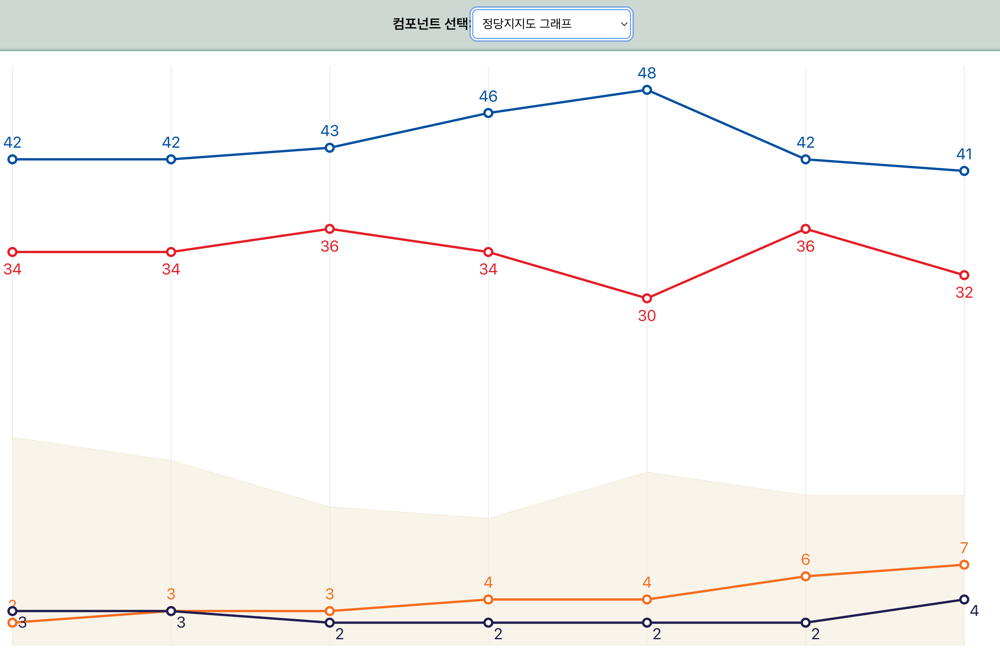
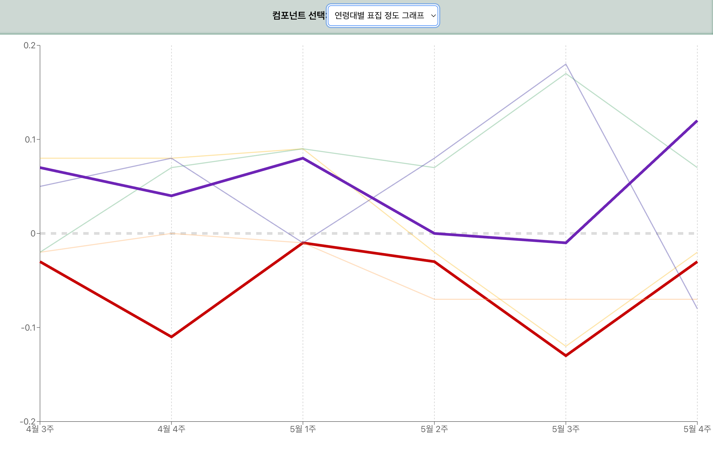

# 차트 구현 with Recharts

코드를 수정하고 싶다면 Recharts 공식문서를 참고하세요.
(https://recharts.org/en-US/api)

> 아래와 같은 그래프들을 생성할 수 있습니다.
>
> | line&Area Composed Chart          | Line Only Chart                      |
> | --------------------------------- | ------------------------------------ |
> |  |  |

### 차트 코드

`src/components/`

- ComposedChart : 선 그래프(Line)와 구역 그래프(Area)를 한 차트에 동시에 구현하기 위함

### 데이터 코드

`src/data/`

#### 데이터 형식

```js
// JSON 형식으로 표현합니다.
[
  {
    name: "4월 3주", // x축
    더불어민주당: 42,
    국민의힘: 34,
    조국혁신당: 3,
    개혁신당: 2,
    무당층: 18,
  },
];
```

## 실행 방법

`npm run dev`
